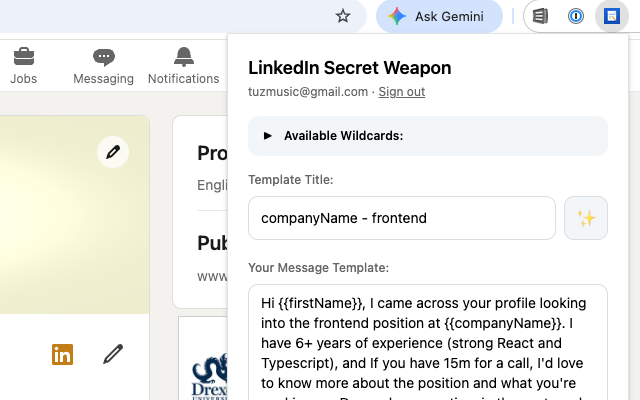

# LinkedIn Secret Weapon

**With 3 keystrokes, send someone a LinkedIn connection request with a personalized message built from their
profile.** Write your message once with wildcards like `{{firstName}}` and `{{companyName}}`. On any profile, press
`Option+C` (Connect), `Option+N` (add your filled-in note), `Option+Shift+S` (send).

**[Install from the Chrome Web Store](https://chromewebstore.google.com/detail/linkedin-secret-weapon/lemllkepipijimjaobiapmipedjmnonp)**



## Why

A connection request with a real note gets accepted far more often than a blank one, but writing a fresh note for every
profile is slow, and copy-paste-and-edit is how you end up calling someone by the last person's name. This extension
reads the profile you're on and fills your template for you, so personalizing takes a keystroke instead of a minute.

It doesn't automate sending. You still look at every profile and press Send yourself; it just removes the busywork.

## What it does

- **Templates with wildcards.** `{{firstName}}`, `{{lastName}}`, `{{fullName}}`, `{{companyName}}`, `{{position}}`,
  `{{headline}}`, `{{location}}`, filled from the profile you're viewing.
- **Introduction requests.** `{{msgFirstName}}` / `{{msgFullName}}` fill from the person in your open message thread,
  so you can write "Hi {{msgFirstName}}, could you introduce me to {{firstName}}?"
- **Keyboard-driven flow.** `Option+V` copies the note, `Option+C` opens Connect, `Option+N` opens "Add a note" and
  inserts the filled template, `Option+Shift+S` sends. Rebind any of them at `chrome://extensions/shortcuts`.
- **Many templates.** Search, sort (name / created / updated), click a wildcard to insert it, pick a template and it's
  live.
- **Character limit check.** Warns past LinkedIn's 300-character limit, or set your own (or none).
- **Cloud sync.** Sign in and your templates follow you across devices. If the network is down, it keeps working from
  the local cache.

## How it's built

- **Chrome MV3** extension: service worker for shortcuts, content script for LinkedIn, **Preact** popup and options page.
- **TypeScript**, **Tailwind CSS**, **Vite** + **CRXJS**.
- **Supabase** (Postgres + Auth) for accounts and sync, schema managed with **Prisma** migrations, row-level security on
  every table. Local-first: templates load from `chrome.storage.local` immediately and sync in the background.
- Profile scraping is isolated in `src/content/profile-scraper.ts`, since LinkedIn's markup changes often (see
  v0.3.0 in the [changelog](CHANGELOG.md)).

```
src/
  background/   service worker: keyboard commands → content script messages
  content/      profile scraper, template filler, LinkedIn button handlers, toasts
  popup/        template editor, list, search, auth (Preact)
  options/      settings page
  utils/        storage, Supabase client, auth storage
prisma/         schema and migrations
supabase/       local Supabase config
```

## Build from source

```bash
npm install
npm run build        # outputs dist/ and release/release-*.zip
```

Then `chrome://extensions` → Developer mode → **Load unpacked** → select `dist/`.

To develop against a local Supabase: `npm run supabase` (wraps the Supabase CLI), then `npm run dev`. Use
`npm run dev:remote` / `npm run build:remote` to target the hosted project.

## Using it

1. Click the toolbar icon, sign in, and write a template, e.g.
   `Hi {{firstName}}, I noticed you work at {{companyName}}. I'd love to connect!`
2. Go to a LinkedIn profile (`linkedin.com/in/...`).
3. Press `Option+C`, then `Option+N`: the note box opens with your message filled in. Or press `Option+V` and paste it
   wherever you like.

On Windows/Linux, use `Alt` in place of `Option`. If a wildcard can't be found on the profile, it's left blank (company
shows `COMPANY_NAME` so you notice).

## Privacy

- Runs only on linkedin.com.
- Templates are stored in your account (Supabase) and cached locally. Nothing is shared with third parties.
- Profile data is read only when you trigger a shortcut, and only to fill your template.

## Disclaimer

Not affiliated with LinkedIn. It does not send connection requests on its own; use it in line with LinkedIn's Terms of
Service.

## License

MIT
